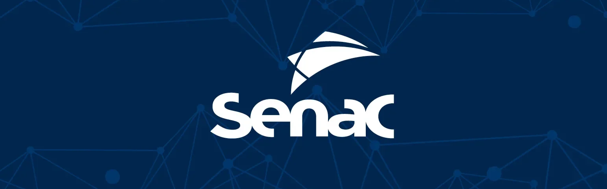

---

## 🧡Bem-vindo(a) ao SenacOS!💙

O **SenacOS** nasceu inspirado na filosofia *Open Source* e na arquitetura de um sistema operacional: um ecossistema vivo, distribuído e em constante evolução. Somos o ponto de encontro de estudantes de tecnologia do Senac de norte a sul do país.

Este espaço foi desenhado para centralizar o que há de melhor nas produções acadêmicas e projetos independentes da nossa comunidade nacional, transformando desafios de código em aprendizado coletivo, colaboração real e evolução de carreira. É o ambiente ideal para quem quer expor seus projetos na vitrine, debater boas práticas com outros devs e preparar o portfólio para os desafios do mercado real.

### O que somos

Somos uma **rede de apoio nacional independente** para estudantes de tecnologia do **Senac Brasil** — do Amapá ao Rio Grande do Sul. Não importa o curso, não importa a unidade: se você escreve código (ou está aprendendo a escrever), você tem espaço aqui.

A comunidade é **pública e aberta**. Visitantes externos, recrutadores e profissionais da área são muito bem-vindos para explorar, acompanhar e utilizar os projetos como material de estudo. O que construímos aqui, construímos para todo mundo.

---

## 📌 Projetos em Destaque

<table>
<tr>
<td>

<a href="https://github.com/SenacOS/Nutri-PI">
  <picture>
    <source media="(prefers-color-scheme: dark)" 
            srcset="https://senacos-stats.vercel.app/api/pin/?username=SenacOS&repo=Nutri-PI&show_owner=true&bg_color=001F3D&title_color=F29111&text_color=CCCCCC&icon_color=F29111&border_color=005493"/>
    
  </picture>
</a>

</td>
<td>

<a href="https://github.com/SenacOS/Roupas_Angular-PI">
  <picture>
    <source media="(prefers-color-scheme: dark)" 
            srcset="https://senacos-stats.vercel.app/api/pin/?username=SenacOS&repo=Roupas_Angular-PI&show_owner=true&bg_color=001F3D&title_color=F29111&text_color=CCCCCC&icon_color=F29111&border_color=005493"/>
    
  </picture>
</a>

</td>
</tr>
</table>

> 💡 Quer ver todos os projetos? Acesse a aba de [repositórios da organização](https://github.com/orgs/SenacOS/repositories).

---

## ⚙️ Metodologia & Integridade do Ecossistema

No **SenacOS**, a liberdade criativa anda de mãos dadas com a integridade do código. Somos uma comunidade aberta a qualquer linguagem ou framework, mas acreditamos que um bom projeto precisa de alicerces sólidos.

Para manter a organização profissional e segura, operamos sob as seguintes diretrizes:

- **Gestão Ágil Integrada:** Fornecemos templates padronizados e conectados ao **GitHub Projects** (com fluxos no estilo Kanban, dentre outros) para apoiar os alunos na organização de suas entregas acadêmicas e autorais.

- **Governança Automatizada:** Blindamos as branches principais da organização utilizando **GitHub Rulesets**. Esse filtro garante que nenhum código chegue à vitrine pública sem passar por critérios mínimos de revisão e segurança.

- **Hábitos Profissionais:** Estimulamos a maturidade profissional desde o primeiro dia. O uso de commits semânticos, Pull Requests descritivos e rastreamento de issues faz parte da nossa cultura de desenvolvimento.

---

> **Esta página é apenas o ponto de entrada.**
>
> Quer submeter seu projeto, entender o funcionamento dos nossos Rulesets, ou utilizar nossos templates de gerenciamento? Toda a nossa documentação, guias práticos e as regras de contribuição vivem no nosso repositório central:
>
> #### 🔗[`github.com/SenacOS/core`](https://github.com/SenacOS/core)

---

*Da comunidade para a comunidade.*
*Feito por e para estudantes do Senac*

